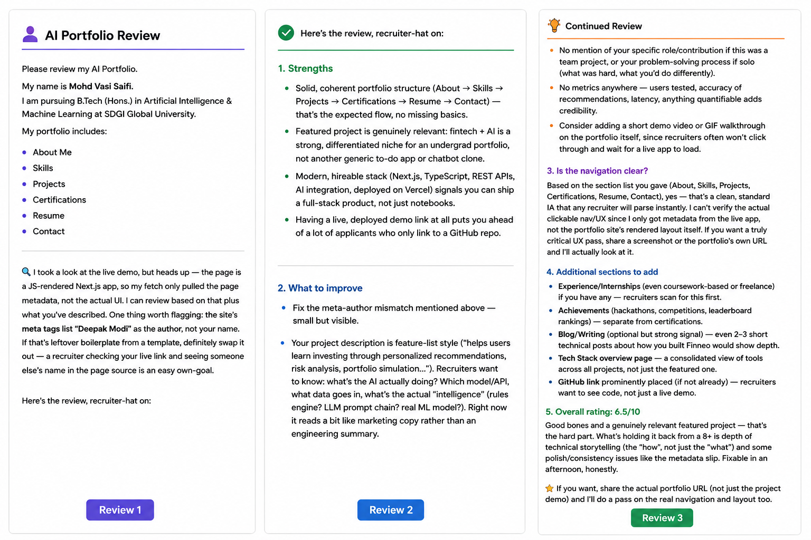

# Portfolio Pressure Test

## Prompt Used

Please review my AI Portfolio as an internship recruiter.

Portfolio:

https://finnio.vercel.app/

Evaluate:

- Strengths
- Weaknesses
- Navigation
- Technical depth
- Portfolio structure
- Suggestions for improvement

Provide an overall rating out of 10.

---

# Claude Review Summary

## Strengths

- Professional portfolio structure.
- Modern technology stack.
- AI-based featured project.
- Live deployment available.
- Clean navigation.

---

## Areas for Improvement

- Improve technical storytelling.
- Add measurable project results.
- Include GitHub link prominently.
- Add internship or experience section.
- Add achievements section.
- Add technical blog section.
- Explain personal contribution in projects.

---

## Navigation Review

Navigation is simple and easy to understand.

Recommended order:

About → Skills → Projects → Certifications → Resume → Contact

---

## Overall Rating

6.5 / 10

---

## Reflection

This review helped identify several improvements that can increase the professionalism and technical depth of my portfolio.

Future improvements include:

- Better project documentation
- Stronger technical explanations
- More measurable achievements
- Additional experience and certifications
- Continuous portfolio updates

---

# Conclusion

The portfolio provides a solid foundation and demonstrates AI and web development skills. Continued improvements in documentation, technical depth, and presentation will strengthen my profile for internship and software engineering opportunities.
# Pressure Test

