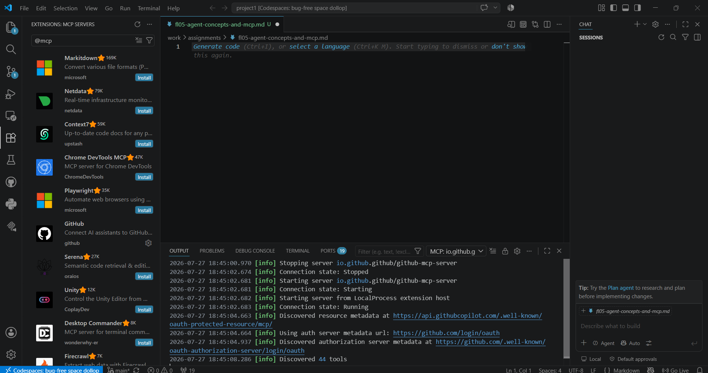
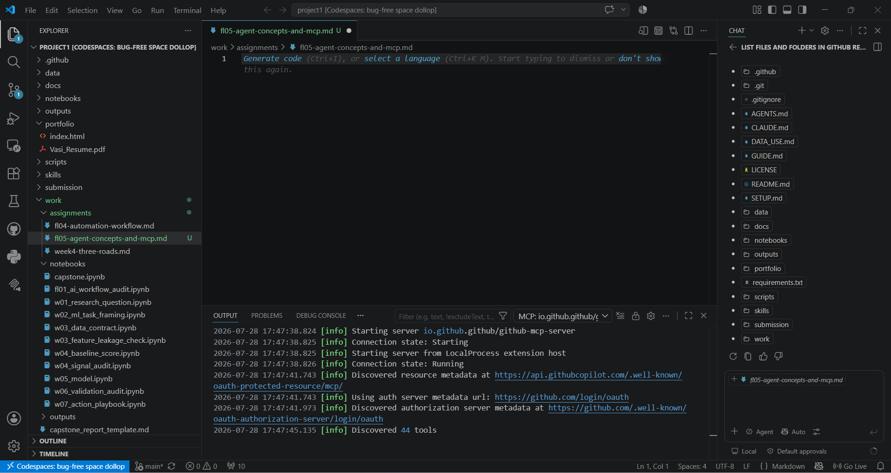
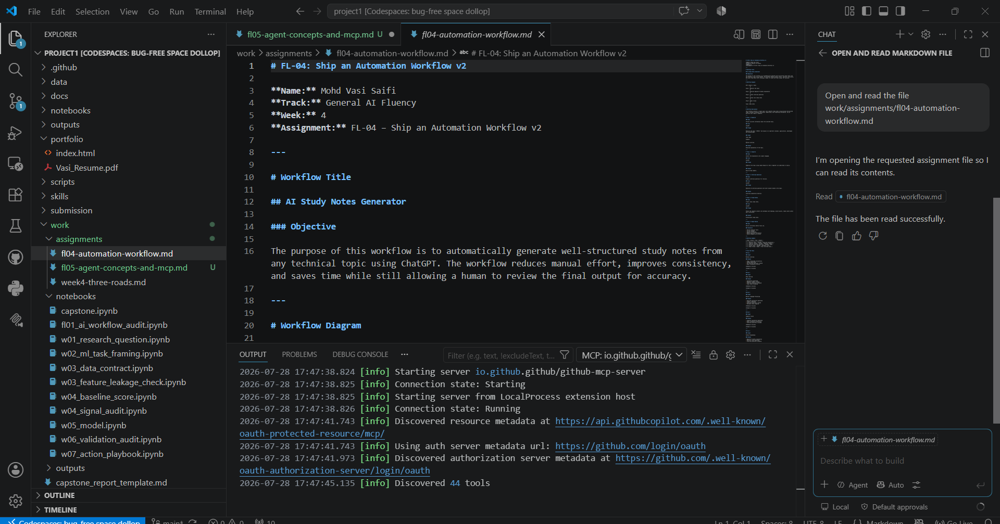
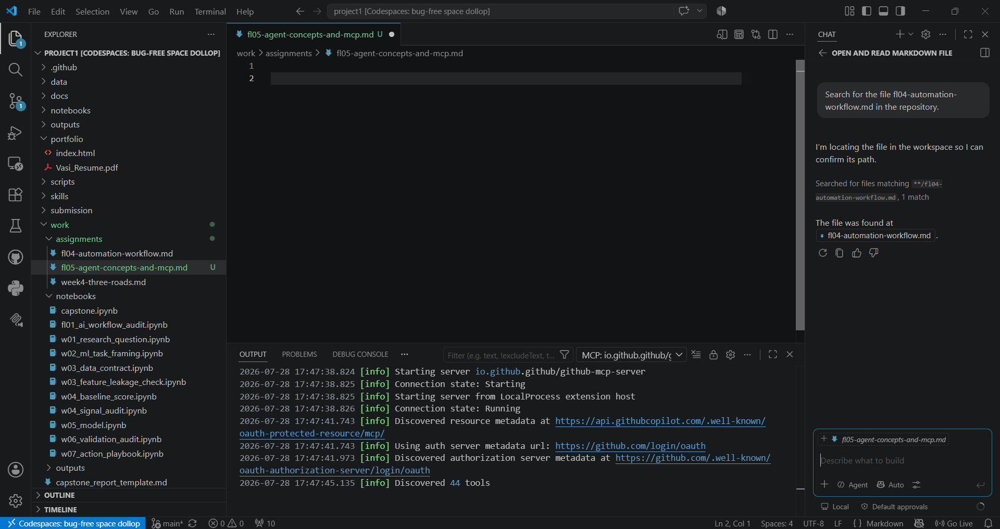

# Evidence of MCP Setup

**Name:** Mohd Vasi Saifi  
**Track:** General AI Fluency  
**Week:** 4  
**Assignment:** FL-05 – Agent Concepts and MCP

---

# MCP Server Used

**GitHub MCP Server**

## Overview

This document provides evidence that the GitHub Model Context Protocol (MCP) Server was successfully configured and used within Visual Studio Code (GitHub Codespaces). The server was used to interact with the GitHub repository by listing repository files, reading Markdown files, and searching for files.

---

# Screenshot 1 – MCP Connected



## Objective

Verify that the GitHub MCP Server is installed and successfully connected to Visual Studio Code.

## Steps Performed

1. Opened the GitHub Codespace in Visual Studio Code.
2. Installed the GitHub MCP Server extension.
3. Started the MCP server.
4. Opened the Output panel.
5. Verified that the connection state changed to **Running**.
6. Confirmed that the server discovered the available GitHub tools.

## Observation

The Output panel displayed:

- Connection state: Running
- GitHub MCP Server started successfully
- Discovered available tools

## Result

The GitHub MCP Server connected successfully and was ready to execute repository operations.

---

# Task 1 – List Repository Files

## Objective

Display the files and folders available inside the GitHub repository.



## Steps Performed

1. Opened the Chat panel.
2. Entered the prompt:

```
List files and folders in GitHub repository.
```

3. The MCP Server scanned the repository.
4. The repository structure was displayed in the Chat panel.
5. Verified that folders such as `.github`, `docs`, `work`, `scripts`, `portfolio`, and others were listed.

## Observation

The GitHub MCP Server returned the complete repository structure.

## Result

The repository contents were successfully retrieved using the MCP Server.

---

# Task 2 – Read a Markdown File

## Objective

Open and read the following Markdown file:

```
work/assignments/fl04-automation-workflow.md
```



## Steps Performed

1. Opened the Chat panel.
2. Entered the prompt:

```
Open and read the file work/assignments/fl04-automation-workflow.md
```

3. The GitHub MCP Server opened the file.
4. The Markdown content appeared in the editor.
5. The Chat panel confirmed that the file had been read successfully.

## Observation

The complete Markdown file contents were displayed without errors.

## Result

The GitHub MCP Server successfully accessed and displayed the requested Markdown document.

---

# Task 3 – Search Repository

## Objective

Search the repository for a Markdown file.



## Steps Performed

1. Opened the Chat panel.
2. Entered the prompt:

```
Search for the file fl04-automation-workflow.md in the repository.
```

3. The GitHub MCP Server searched the repository.
4. One matching file was found.
5. The file location was returned in the Chat panel.

## Observation

The server successfully located the requested Markdown file.

## Result

The GitHub MCP Server successfully performed a repository search and returned the correct file.

---

# Conclusion

The GitHub MCP Server was successfully configured and connected within Visual Studio Code. All required operations—listing repository files, reading a Markdown file, and searching the repository—were completed successfully. The screenshots provided above serve as evidence of successful MCP setup and operation.

---

**Submitted By**

**Mohd Vasi Saifi**

**Track:** General AI Fluency

**Week 4 – FL-05 Agent Concepts and MCP
